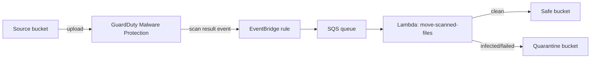

# guardduty-malware-protection

Reusable Terraform module that wires up GuardDuty Malware Protection for an S3
bucket and automatically moves scanned objects to a "safe" or "quarantine"
bucket based on the scan result.

## What it creates

- `aws_guardduty_malware_protection_plan` on the given source bucket, plus the
  IAM role/policy GuardDuty needs to scan and tag objects.
- An EventBridge rule matching `GuardDuty Malware Protection Object Scan
  Result` events for the source bucket, targeting an SQS queue (with a DLQ).
- A Lambda function, triggered by the SQS queue, that copies each scanned
  object to the safe bucket (when the scan result is `NO_THREATS_FOUND`) or
  the quarantine bucket (otherwise), then deletes the object from the source
  bucket. See [lambda_src/README.md](lambda_src/README.md) for the handler's
  own documentation (environment variables, event shape, local testing).



## Requirements

| Name      | Version  |
| --------- | -------- |
| terraform | >= 1.5   |
| aws       | >= 5.0   |
| archive   | >= 2.4   |

## Usage

```hcl
module "malware_protection" {
  source = "../../modules/guardduty-malware-protection"

  name_prefix = "myapp-uploads"

  source_bucket_id  = aws_s3_bucket.uploads.id
  source_bucket_arn = aws_s3_bucket.uploads.arn

  safe_bucket_id  = aws_s3_bucket.uploads_safe.id
  safe_bucket_arn = aws_s3_bucket.uploads_safe.arn

  quarantine_bucket_id  = aws_s3_bucket.uploads_quarantine.id
  quarantine_bucket_arn = aws_s3_bucket.uploads_quarantine.arn
}
```

See [examples/guardduty-malware-protection](../../examples/guardduty-malware-protection)
for a runnable example.

## Inputs

| Name                                         | Description                                                                                                   | Type           | Default  | Required |
| --------------------------------------------- | --------------------------------------------------------------------------------------------------------------- | -------------- | -------- | :------: |
| `name_prefix`                                  | Prefix used to name all resources created by this module.                                                       | `string`       | n/a      |   yes    |
| `source_bucket_id`                             | Name (id) of the S3 bucket that receives untrusted uploads and should be protected by GuardDuty malware protection. | `string`       | n/a      |   yes    |
| `source_bucket_arn`                            | ARN of the source bucket.                                                                                        | `string`       | n/a      |   yes    |
| `safe_bucket_id`                                | Name (id) of the S3 bucket that clean (`NO_THREATS_FOUND`) objects are moved to.                                  | `string`       | n/a      |   yes    |
| `safe_bucket_arn`                               | ARN of the safe bucket.                                                                                          | `string`       | n/a      |   yes    |
| `quarantine_bucket_id`                          | Name (id) of the S3 bucket that infected/failed-scan objects are moved to.                                        | `string`       | n/a      |   yes    |
| `quarantine_bucket_arn`                         | ARN of the quarantine bucket.                                                                                    | `string`       | n/a      |   yes    |
| `object_key_prefixes`                           | Optional key prefixes used to filter which objects in the source bucket trigger the EventBridge rule. Empty list matches all objects. | `list(string)` | `[]`     |    no    |
| `delete_source_object_after_move`               | Whether the lambda deletes the original object from the source bucket after copying it.                          | `bool`         | `true`   |    no    |
| `tags`                                          | Tags applied to all resources created by this module.                                                           | `map(string)`  | `{}`     |    no    |
| `lambda_runtime`                                | Lambda runtime for the file-mover function.                                                                     | `string`       | `"python3.13"` | no  |
| `lambda_timeout`                                | Lambda function timeout in seconds.                                                                             | `number`       | `60`     |    no    |
| `lambda_memory_size`                            | Lambda function memory size in MB.                                                                              | `number`       | `256`    |    no    |
| `lambda_log_retention_in_days`                  | CloudWatch log group retention in days for the lambda function.                                                  | `number`       | `30`     |    no    |
| `lambda_reserved_concurrent_executions`         | Reserved concurrent executions for the lambda function. `-1` means unreserved.                                   | `number`       | `-1`     |    no    |
| `sqs_visibility_timeout_seconds`                | Visibility timeout for the SQS queue. Should be at least 6x the lambda timeout.                                  | `number`       | `360`    |    no    |
| `sqs_message_retention_seconds`                 | Message retention period for the SQS queue, in seconds.                                                          | `number`       | `345600` |    no    |
| `sqs_max_receive_count`                         | Number of times a message is delivered before being sent to the dead-letter queue.                                | `number`       | `5`      |    no    |
| `lambda_batch_size`                             | Maximum number of SQS records the lambda receives per invocation.                                                | `number`       | `10`     |    no    |
| `lambda_maximum_batching_window_in_seconds`     | Maximum batching window for the SQS event source mapping.                                                        | `number`       | `0`      |    no    |
| `kms_key_arn`                                   | Optional KMS key ARN used to encrypt the SQS queue and lambda environment variables. `null` uses SSE-SQS.        | `string`       | `null`   |    no    |

## Outputs

| Name                                    | Description                                                          |
| ------------------------------------------ | ----------------------------------------------------------------------- |
| `guardduty_malware_protection_plan_id`     | ID of the GuardDuty malware protection plan.                            |
| `guardduty_malware_protection_plan_arn`    | ARN of the GuardDuty malware protection plan.                           |
| `guardduty_role_arn`                       | ARN of the IAM role assumed by GuardDuty to scan the source bucket.     |
| `eventbridge_rule_arn`                     | ARN of the EventBridge rule matching GuardDuty scan result events.      |
| `sqs_queue_arn`                            | ARN of the SQS queue that receives scan result events.                  |
| `sqs_queue_url`                            | URL of the SQS queue that receives scan result events.                  |
| `sqs_dlq_arn`                              | ARN of the SQS dead-letter queue.                                       |
| `lambda_function_arn`                      | ARN of the lambda function that moves scanned objects.                  |
| `lambda_function_name`                     | Name of the lambda function that moves scanned objects.                 |
| `lambda_role_arn`                          | ARN of the lambda execution role.                                       |

## Notes

- The source, safe, and quarantine buckets must already exist (created
  outside of this module) and be passed in by id/arn.
- Only the source bucket is registered with GuardDuty Malware Protection; the
  safe and quarantine buckets are plain destinations that the lambda is
  granted `s3:PutObject`/`s3:PutObjectTagging` on.
- Set `object_key_prefixes` to scope the EventBridge rule (and therefore the
  move) to a subset of objects in the source bucket.
- Set `delete_source_object_after_move = false` to keep a copy of the
  original object in the source bucket instead of deleting it.
- Pass `kms_key_arn` to encrypt the SQS queue and lambda environment
  variables with a customer-managed key; otherwise SSE-SQS is used.
- The lambda has no third-party runtime dependencies (stdlib + `boto3`, which
  is pre-installed in the Lambda Python runtime), so no build step is needed
  before packaging — see [lambda_src/README.md](lambda_src/README.md) for
  local dev/test tooling.
